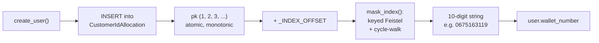

# Wallet Number Generation

How DrutoPay allocates the internal `wallet_number` for every user, why it is
built this way, and how it compares to real MFS platforms (bKash / Nagad / Upay).

- Code: [`accounts/identity.py`](../accounts/identity.py)
- Wired in: [`accounts/models/user.py`](../accounts/models/user.py) (`UserManager.create_user`)
- Migration: [`accounts/migrations/0003_customeridallocation.py`](../accounts/migrations/0003_customeridallocation.py)
- Secret: `WALLET_NUMBER_SECRET` in `.env`

---

## 1. What `wallet_number` is (and is not)

`wallet_number` is the **PII-free internal handle** for a user.

| It IS | It is NOT |
| --- | --- |
| The id other tables/services reference (`wallet`, future `ledger`, logs, admin, analytics) | The login identifier — that is `phone_number_hash` |
| A pseudonym: carries no name, phone, or NID | A "send money to this number" account (real apps use the MSISDN for that) |
| Stable forever (`editable = False`) | A number a customer needs to memorise |
| `unique = True` | Sequential or guessable |

The point of having it at all: the phone number is regulated PII. Passing a
surrogate id around the system means logs, analytics, support tools and
inter-service calls never carry the phone number. This is **pseudonymisation**,
and it is standard practice in fintech / banking cores (often called a
CIF — Customer Information File — number).

---

## 2. The problem with the original generator

```python
# OLD — removed
def generate_wallet_number() -> str:
    while True:
        number = ''.join(random.choices('0123456789', k=10))
        if not User.objects.filter(wallet_number=number).exists():
            return number
```

Four defects:

1. **`random.choices` is not cryptographically secure.** It is the Mersenne
   Twister PRNG; observe a handful of outputs and future values become
   predictable. An id that other users or systems may see should not be
   predictable.
2. **Check-then-act race.** Two concurrent signups can both generate the same
   number, both see `.exists() == False`, and both proceed. The `unique`
   constraint stops a real duplicate, but the loser gets an `IntegrityError`
   (HTTP 500) instead of a clean retry.
3. **Cost grows with table size.** As the table fills, birthday collisions rise
   and each retry is another full indexed query — it degrades exactly when
   traffic is highest.
4. **No structure, no guarantees.** Nothing makes the value non-sequential-
   looking on purpose, nothing bounds retries, nothing is documented.

---

## 3. Design principle: separate the two concerns

Generating a good surrogate id means satisfying two *independent* requirements.
Trying to get both from "random + collision check" is what makes that approach
fragile. Instead:

| Requirement | Solved by | Property relied on |
| --- | --- | --- |
| **Uniqueness + monotonic allocation, no races** | A database counter (`CustomerIdAllocation`) | The DB serialises inserts; an autoincrement PK is atomic |
| **Opacity** (no visible order, rate, or volume) | A keyed **Feistel permutation** over the sequential index | A Feistel network is always a *bijection*, so distinct indexes → distinct outputs |

Uniqueness comes from the counter and is **never re-checked**. Opacity is a pure
function applied on top. Neither depends on the other.



---

## 4. Component 1 — the central counter

```python
class CustomerIdAllocation(models.Model):
    id = models.BigAutoField(primary_key=True)
    created_at = models.DateTimeField(auto_now_add=True)

    class Meta:
        db_table = "accounts_customer_id_allocation"
```

- **One row per allocated wallet number.** `allocate_wallet_number()` does a
  single `INSERT` and reads back the primary key.
- The autoincrement PK **is** the sequence. `BigAutoField` gives the same
  atomic, monotonic guarantee on SQLite *and* PostgreSQL, so the allocator is
  portable — no raw `CREATE SEQUENCE` needed.
- **No race.** The database serialises the insert; two concurrent `create_user`
  calls receive two distinct PKs. No `SELECT ... WHERE EXISTS`, no retry loop.
- **Gaps are expected.** If the surrounding transaction rolls back after the
  insert, that index is consumed and not reused. This matches how a native DB
  sequence behaves. Never assume wallet numbers are contiguous.

### Why a separate table instead of reusing `User.id`?

- `User.id` leaks signup order and volume directly, and is used in URLs/admin.
- Decoupling allocation from the `User` row means the id can be reserved before
  the user row is valid, and the allocator can later move behind its own
  service without touching the `User` schema.

### "Behind an identity service"

At this scale, the counter living in the one Django database *is* centralised —
every signup goes through the same DB. The phrase matters only at microservice
scale, where one **Identity service** would own this table, the MSISDN↔id
mapping, and the encrypted PII, and every other service would store only the id
and call an audited API to resolve it. The current design is the single-process
version of that shape.

---

## 5. Component 2 — the Feistel permutation

### 5.1 Why not just return the counter?

A raw counter (`100000001`, `100000002`, …) exposed anywhere leaks:

- **Order** — who registered before whom.
- **Rate / volume** — subtract two ids seen a week apart → weekly signups.

For a handle whose whole reason to exist is anonymity, that is unacceptable.

### 5.2 What a Feistel network is

A Feistel network turns any keyed function `F` into an **invertible
permutation**. Split an `n`-bit block into halves `L` and `R`; for each round:

```
L, R  =  R,  L XOR F(round, R)
```

Key facts:

- **It is always a bijection**, for *any* `F` — even a bad one. Invertibility is
  structural, not dependent on `F` being reversible. This is the property that
  guarantees "distinct index in → distinct number out", i.e. **no collisions,
  ever, without checking the table**.
- With `F` a good PRF (here HMAC-SHA256), a few rounds make the permutation
  pseudorandom — output reveals nothing about input order.
- It is the core construction behind DES and the NIST format-preserving
  encryption standards (FF1 / FF3).

### 5.3 The implementation

```python
WALLET_NUMBER_DIGITS = 10
_DOMAIN = 10 ** WALLET_NUMBER_DIGITS          # outputs: 0 .. 9_999_999_999
_HALF_BITS = 17                               # 2**34 == (2**17) ** 2
_HALF_MASK = (1 << _HALF_BITS) - 1
_ROUNDS = 4
_INDEX_OFFSET = 1_000_000_000

def _prf(round_no: int, half: int) -> int:
    msg = round_no.to_bytes(1, "big") + half.to_bytes(4, "big")
    digest = hmac.new(settings.WALLET_NUMBER_SECRET.encode(), msg, hashlib.sha256).digest()
    return int.from_bytes(digest[:4], "big") & _HALF_MASK

def _feistel(block: int) -> int:
    left = (block >> _HALF_BITS) & _HALF_MASK
    right = block & _HALF_MASK
    for round_no in range(_ROUNDS):
        left, right = right, left ^ _prf(round_no, right)
    return (left << _HALF_BITS) | right

def mask_index(index: int) -> int:
    value = index % _DOMAIN
    while True:
        value = _feistel(value)
        if value < _DOMAIN:
            return value

def allocate_wallet_number() -> str:
    index = CustomerIdAllocation.objects.create().pk + _INDEX_OFFSET
    return f"{mask_index(index):0{WALLET_NUMBER_DIGITS}d}"
```

### 5.4 Parameter choices explained

| Constant | Value | Why |
| --- | --- | --- |
| `WALLET_NUMBER_DIGITS` | `10` | Matches a familiar id width; `_DOMAIN = 10^10`. |
| `_HALF_BITS` | `17` | Block = `2 x 17 = 34` bits. `2^34 ≈ 1.7 x 10^10`, the smallest power-of-two block that *contains* `10^10`. Halves must be equal, so the block size is `2 x half`. |
| `_ROUNDS` | `4` | Luby–Rackoff: 3 rounds give a secure pseudorandom permutation against chosen-plaintext, 4 against chosen-ciphertext, when the round function is a PRF. 4 is the standard minimum. FPE standards use 8–10 for extra margin — raising this is cheap if you want more (see §11). |
| `_prf` | HMAC-SHA256, keyed by `WALLET_NUMBER_SECRET`, first 4 bytes folded to 17 bits | HMAC-SHA256 is a well-analysed PRF. `round_no` is mixed in so each round differs. The secret is what makes the permutation unguessable. |
| `_INDEX_OFFSET` | `1_000_000_000` | Cosmetic / defence-in-depth: keeps pre-images away from `0` so early ids do not sit at the very edge of the domain. Feistel output is uniform regardless of input, so this does not affect distribution — it is belt-and-suspenders, not load-bearing. |

### 5.5 Cycle-walking (handling a non-power-of-two domain)

The Feistel permutes `[0, 2^34)`, but valid wallet numbers are `[0, 10^10)`.
`2^34` is ~1.7x larger. **Cycle-walking**: if `_feistel(value)` lands in the
"extra" range `[10^10, 2^34)`, encrypt again; repeat until it lands back inside
`[0, 10^10)`.

- Because Feistel is a bijection on `[0, 2^34)`, restricting the walk to
  `[0, 10^10)` is still a bijection there → still collision-free.
- Acceptance probability per step ≈ `10^10 / 2^34 ≈ 0.582`.
- Expected iterations ≈ `1 / 0.582 ≈ 1.72` (measured: **1.721** over 200k
  allocations). Worst case is unbounded in theory but geometrically unlikely;
  in practice it is 1–4 iterations.

### 5.6 Worked example

Verified: allocation PKs `1, 2, 3` produce wallet numbers
`0675163119`, `0949555767`, `8942541949`.

- Inputs `1_000_000_001`, `1_000_000_002`, `1_000_000_003` — consecutive.
- Outputs share no visible relationship — no common prefix, no ordering, no
  fixed delta. Order and volume are hidden.
- Change the secret → completely different outputs for the same PKs.
- `0675163119` has a leading zero: `wallet_number` is a **string**. Never parse
  it as an integer anywhere (§10).

---

## 6. End-to-end flow

`UserManager.create_user` (in `accounts/models/user.py`):

```python
user = self.model(
    phone_number_hash = hash_phone(raw_phone),
    phone_number_encrypted = raw_phone,
    wallet_number = allocate_wallet_number(),   # <-- here
    **extra_fields,
)
user.set_password(password)
user.save(using=self._db)
```

1. `allocate_wallet_number()` inserts one `CustomerIdAllocation` row → PK `n`.
2. `index = n + _INDEX_OFFSET`.
3. `mask_index(index)` → opaque integer in `[0, 10^10)`.
4. Zero-padded to a 10-character string → `user.wallet_number`.
5. `user.save()` writes the `User` row; `unique=True` on `wallet_number` is the
   final backstop (it should never actually fire).

### Transaction behaviour

`create_user` is not wrapped in `transaction.atomic()` today, so step 1 commits
on its own. If `user.save()` later fails, the allocation row remains → a gap
(harmless). If you call `create_user` inside an outer atomic block (e.g. DRF
`ATOMIC_REQUESTS`), the allocation row rolls back with everything else → no gap.
Either way correctness holds: **no duplicate wallet number is possible**.

Optional hardening — make user + allocation atomic:

```python
from django.db import transaction

def create_user(self, password=None, **extra_fields):
    ...
    with transaction.atomic():
        user = self.model(..., wallet_number=allocate_wallet_number(), **extra_fields)
        user.set_password(password)
        user.save(using=self._db)
    return user
```

---

## 7. Files & configuration

| File | Change |
| --- | --- |
| `accounts/identity.py` | New — `CustomerIdAllocation`, Feistel, `allocate_wallet_number()` |
| `accounts/models/user.py` | Removed `generate_wallet_number` + `random` import; manager calls `allocate_wallet_number()` |
| `accounts/models/__init__.py` | Exports `CustomerIdAllocation`, `allocate_wallet_number` |
| `accounts/migrations/0003_customeridallocation.py` | Creates the allocation table |
| `drutopay/settings.py` | Reads `WALLET_NUMBER_SECRET` |
| `.env` | `WALLET_NUMBER_SECRET = <64 hex chars>` |

### The secret

- Generate: `openssl rand -hex 32`
- Store outside the DB (env / secrets manager). It is the only thing standing
  between "internal id" and "reversible to the counter".
- **Changing it re-maps every future wallet number.** Existing rows keep their
  old values (they are stored, not recomputed), so rotation does not corrupt
  data — but new allocations will use the new mapping. Treat it as append-only
  config; only rotate on suspected compromise.
- If it leaks: an attacker who *also* has the DB can invert wallet numbers back
  to allocation order/volume. No financial impact on its own (the id is not a
  credential), but it defeats the anonymity goal — rotate and move on.

---

## 8. Operational properties

| Property | Value |
| --- | --- |
| Uniqueness | Guaranteed by construction (bijection over distinct counter values). `unique=True` is a backstop. |
| Monotonic allocation | Yes — the counter. The *output* is not monotonic (by design). |
| Gaps | Yes, on rolled-back transactions. Expected. |
| Guessable / enumerable | No, without `WALLET_NUMBER_SECRET`. |
| Leaks signup order | No. |
| Leaks signup volume | No. |
| Format | 10-character numeric **string**, may have leading zeros. |
| Collision cost at scale | Zero — no table lookups during allocation. |
| Feistel cost | ~1.72 HMAC-SHA256 calls per allocation. |
| Capacity | `10^10` values. The `index % _DOMAIN` wrap means true uniqueness holds until ~`10^10 − _INDEX_OFFSET ≈ 9 x 10^9` users. Far beyond scope; widen `WALLET_NUMBER_DIGITS` (and `_HALF_BITS`) to extend. |

---

## 9. Security / threat model

| Threat | Mitigation |
| --- | --- |
| Predict future wallet numbers from observed ones | Keyed Feistel — output is pseudorandom without the secret. |
| Enumerate the id space (scrape `/user/<n>` style) | Values are sparse and unordered in a `10^10` space; not derivable from each other. |
| DB dump reveals customer identities | `wallet_number` contains no PII. Phone/NID are separately hashed (lookup) and encrypted (recovery). |
| DB dump + leaked `WALLET_NUMBER_SECRET` | Attacker can invert to allocation order/volume. Not a credential; rotate secret. No fund access. |
| Duplicate id under concurrency | Impossible — counter is atomic, mapping is a bijection, `unique=True` backstop. |

`wallet_number` is an **identifier, not a secret**. Authorisation must never be
"knows the wallet number"; it is always "holds a valid JWT for that user".

---

## 10. Rules for using `wallet_number` elsewhere

- **Always treat it as a string.** `CharField` in Django, `VARCHAR` in any
  other store, string in JSON. Parsing to `int` drops leading zeros and
  produces a *different* valid-looking id.
- **Never regenerate it** for an existing user. It is a foreign key everywhere.
- **Never use it for authorization decisions.** It is not a bearer token.
- Downstream tables (`wallet`, `ledger`, transaction records) should reference
  `wallet_number` (or a FK to `User`), never `phone_number_*`.

---

## 11. Possible future improvements

1. **More Feistel rounds** — bump `_ROUNDS` to 8 for FPE-standard margin.
   Cost is linear (~2x HMAC calls); output values change, so do it before
   any real data exists or accept a mapping change for new rows.
2. **Wrap `create_user` in `transaction.atomic()`** so allocation rows never
   orphan (§6).
3. **Move to PostgreSQL** and, if desired, back the counter with a native
   `CREATE SEQUENCE` instead of a table — the identity module's public API
   (`allocate_wallet_number`) stays the same.
4. **Key versioning** — store a `key_version` alongside each allocation so the
   secret can be rotated with a known cutover point.
5. **Extract an Identity service** once other apps need customer data — it owns
   this table plus the encrypted PII, and exposes an audited resolve API.
6. **Decode helper for ops** (optional): the Feistel is invertible, so a
   `unmask()` / `_feistel_inverse()` pair can map a wallet number back to its
   allocation index for debugging. Requires the secret; keep it out of normal
   code paths.

---

## 12. How bKash / Nagad / Upay do it

Not published, but from public behaviour + standard MFS/core-banking practice:

- **Customer-facing account number = the MSISDN (phone number).** There is no
  generated public account number like a bank gives you. `*247#`, the app, and
  agent transactions all route on the phone number. DrutoPay keeps the phone as
  `phone_number_hash` (lookup) + `phone_number_encrypted` (recovery) and does
  **not** expose `wallet_number` to customers — same split.
- **Internally, a surrogate customer id (numeric CIF or UUID), not the MSISDN.**
  Allocated centrally by an identity/customer service via a DB sequence or
  UUID — never `random` + collision-check in application code. `wallet_number`
  is DrutoPay's version of this.
- **Agent / merchant till numbers** are a different thing: short, centrally
  allocated from a managed pool, usually with a check digit, and printed at the
  shop. Not minted ad hoc at signup.
- **The interbank layer** (NPSB / Binimoy) uses bank account numbers with
  institution prefixes (BIN) and check digits because they route between
  institutions — that is plumbing, not customer identity.

DrutoPay's model — *phone hashed for lookup, phone encrypted for recovery,
`wallet_number` as the PII-free internal handle* — matches the real shape. The
only thing this change fixed was **how** the internal handle is minted:
central counter + keyed bijection, instead of predictable randomness with a
racy uniqueness check.

---

## 13. Verifying it

```bash
python manage.py migrate accounts
python manage.py shell   # then paste:
```

```python
from accounts.models import User, CustomerIdAllocation
nums = [User.objects.create_user(phone_number=p, password="123456").wallet_number
        for p in ["01711111111", "01822222222", "01933333333"]]
print(nums)                                   # ['0675163119', '0949555767', '8942541949']
print(all(len(n) == 10 and n.isdigit() for n in nums))   # True
print(len(set(nums)) == len(nums))            # True
print(CustomerIdAllocation.objects.count())   # 3
User.objects.exclude(is_superuser=True).delete()   # cleanup
```

With the committed `WALLET_NUMBER_SECRET`, PKs 1–3 always map to those three
values — a fixed regression check that the counter, secret, and mask are wired
correctly.
